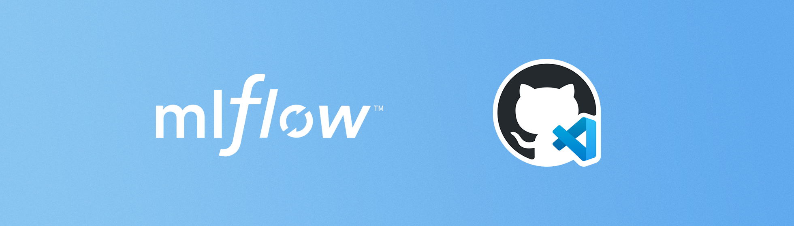
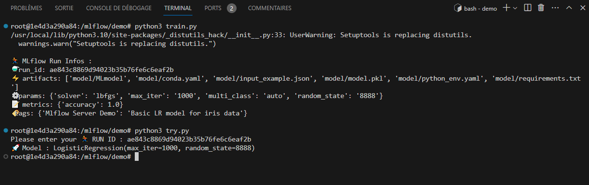

<picture>
  
</picture>

# Lancer un serveur MLflow dans un codespace GitHub

Vous trouverez dans ce dépôt, tous les éléments nécessaires pour démarrer un [serveur MLflow](https://mlflow.org/docs/latest/tracking/tutorials/remote-server.html) dans un [codespace](https://docs.github.com/fr/codespaces/overview) ([Dev Container](https://containers.dev/)). 

## 🔮 A propos de MLflow

[MLflow](https://mlflow.org/docs/latest/introduction/index.html) simplifie le flux de travail en ML avec des outils pour le suivi (tracking), la gestion des modèles, le déploiement, l'évaluation, l'ingénierie des prompts, les recettes et les projets ML. Plus d'informations sur MLflow, rendez-vous sur la [documentation de MLflow](https://mlflow.org/docs/latest/index.html).
 
## 🚀 Lancer un serveur MLflow dans codespace

Vous avez besoin d'un serveur **MLflow hébergé gratuitement** ? Suivez les étapes suivantes.

### 1. Dupliquez (fork) ce dépôt

### 2. Renseignez les variables d'environnement

Allez à la page de configuration des **variables d'environnement pour Codespaces** du dépôt, à l'adresse suivante : `https://github.com/[votre-nom-utilisateur]/mlflow-server-devcontainer/settings/secrets/codespaces`. Renseignez les variables suivantes :

- `ARTIFACT_STORE_URI` : L'URI de stockage des artéfacts (Amazon S3).
- `AWS_ACCESS_KEY_ID` et `AWS_SECRET_ACCESS_KEY` : Les identifiants de connexion à l'espace de stockage Amazon S3. 
- `BACKEND_STORE_URI` : L'URI de votre base de donnée. Pour une base de donnée PostgreSQL, l'URI se présente au format : `postgresql://[username]:[password]@[host]:[port]/[database]
Plus de renseignements sur la configuration d'un serveur de tracking MLflow : [Set up the MLflow Tracking Environment](https://mlflow.org/docs/latest/tracking.html#set-up-the-mlflow-tracking-environment).

<picture>
  
</picture>

### 3. Lancez un nouveau codespace

Lancez un nouveau codespace à partir de votre dépôt (UI de GitHub: Code / Codespaces / +)

<picture>
  
</picture>

### 4. Ouvrez le port 5001

Dans le Terminal, onglet "Ports", **définissez l'URL du port 5001 comme public**.

<picture>
  
</picture>

### 5. Accédez à l'UI MLflow

Accéder à l'UI MLflow en accédant à l'**URL public exposée par codespace**. Utilisez cette URL pour le tracking de vos travaux de machine learning depuis un notebook Colab ou notebook local.

<picture>
  
</picture>

### 6. (Optionnel) Testez votre serveur MLflow

A l'intérieur du codespace, exécutez les étapes suivantes : 

1. **Entrainez un modèle** : `python3 demo/train.py`. Vous devez voir apparaître un nouveau run dans l'UI MLflow et dans le Terminal.
2. **Copiez le numéro de Run** : Copiez le numéro de run (run id) qui apparaît dans le Terminal.
3. **Utilisez un modèle** : `python3 demo/try-model.py`. Entrez le numero de run (run id) dans le Terminal. Cette commande retourne un modèle dans le Terminal, cela signifie que vos modèle trackés par votre serveur MLflow sont disponibles à l'utilisation.

<picture>
  
</picture>

### 7. Utilisation depuis un notebook Colab

Démonstration de l'utilisation du serveur de tracking depuis ce notebook : 

- Modifiez les variables d'environnement suivantes dans l'onglet "🔑 Secrets" :
  - `MLFLOW_TRACKING_URI` 
  - `AWS_ACCESS_KEY_ID`
  - `AWS_SECRET_ACCESS_KEY`

<picture>
  
</picture>

Votre serveur MLflow fonctionne maintenant depuis votre codespace et vous pouvez trackez vos expériences de machine learning. **N'oubliez pas de lancer et d'éteindre votre codespace à chaque utilisation**. Sans quoi, du temps d'utilisation vous sera décompté.

## 👾 A Propos

**David Scanu**, étudiant en Intelligence artificielle à l'école **Microsoft IA par Simplon et ISEN**.

