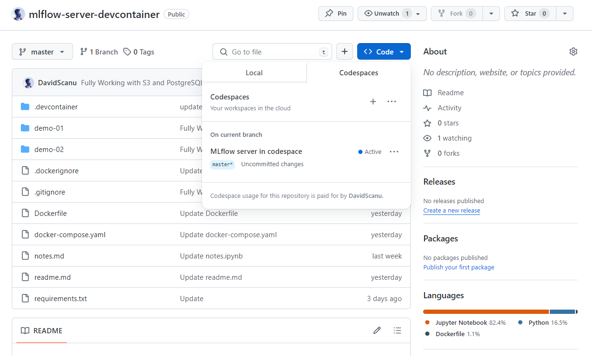
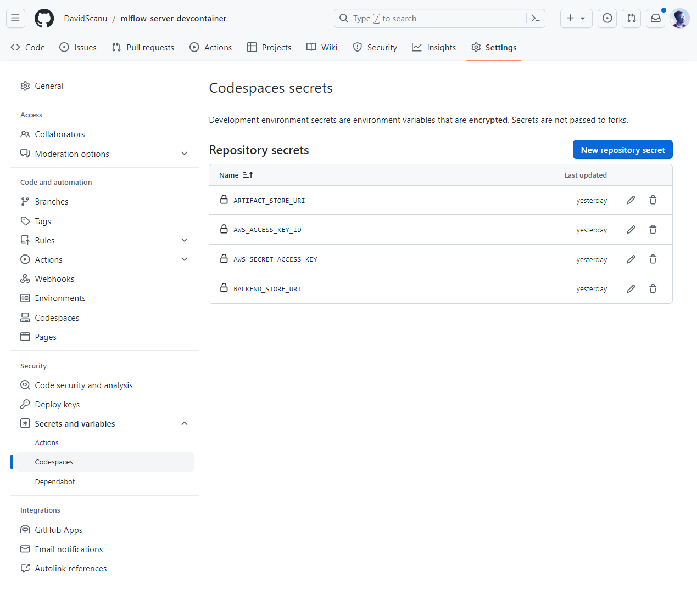
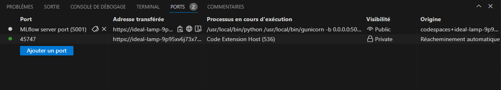
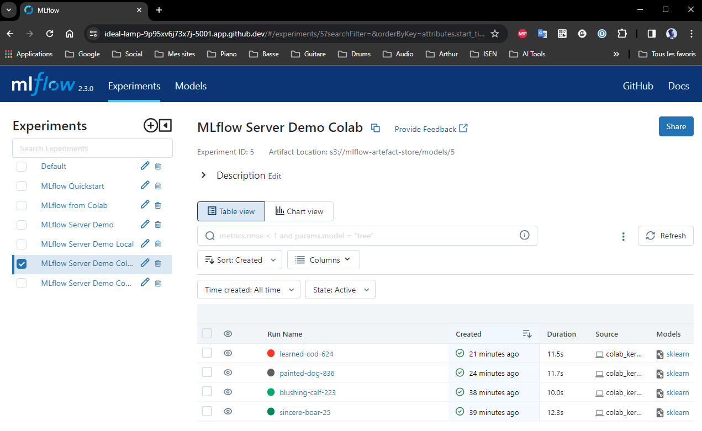
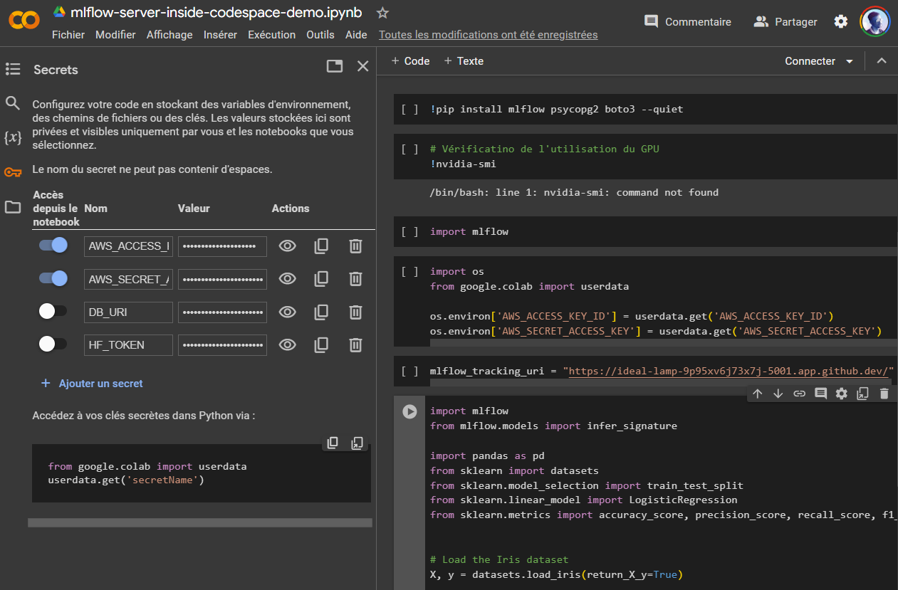

# Lancer un serveur MLflow dans un codespace (Dev Container)

Vous trouverez dans ce dépôt, tous les éléments nécessaires pour démarrer un [serveur MLflow](https://mlflow.org/docs/latest/tracking/tutorials/remote-server.html) dans un [codespace](https://docs.github.com/fr/codespaces/overview) ([Dev Container](https://containers.dev/)). 

## 🧾 TODO

- Améliorer le "Port Forwarding" : 5001 (rendre ce port "public" et ouvrir le navigateur automatiquement)
- refaire tutorial.ipynb
- Variables d'environnement dans Dev Container local

## 🔮 A propos de MLflow

[MLflow](https://mlflow.org/docs/latest/introduction/index.html) fournit une suite d'outils visant à simplifier le flux de travail ML. Il est conçu pour aider les développeurs tout au long des différentes étapes de développement et de déploiement du ML. Les fonctionnalités principales de MLflow  sont :

- **Tracking**: MLflow Tracking fournit à la fois une API et une interface utilisateur dédiées à la journalisation des paramètres, des versions de code, des métriques et des artefacts pendant le processus ML.
- **Model Registry**: Une approche systématique de la gestion des modèles, aidant à gérer différentes versions de modèles et assurant une production fluide.
- **MLflow Deployments for LLMs**: Un serveur équipé d'API standardisées pour un accès simplifié aux modèles SaaS et OSS LLM.
- **Evaluate**: Outils conçus pour une analyse et une comparaison approfondies des modèles.
- **Prompt Engineering UI**: Outils conçus pour une analyse et une comparaison approfondies des modèles.
- **Recipes**: Lignes directrices pour structurer les projets ML, visant à garantir des résultats optimisés pour des scénarios de déploiement réels.
- **Projects**: Standardisez l'empaquetage du code ML, des flux de travail et des artefacts, en définissant les dépendances et les méthodes d'exécution pour chaque projet.
 
## 🚀 Lancer un serveur MLflow dans codespace (serveur distant) 

### 1. Créer un nouveau codespace à partir de ce dépôt (UI de GitHub: Code / Codespaces / +)

### 2. Renseignez ces variables d'environnement dans Codespaces secrets

### 3. Ouvrir le port 5011

Dans le Terminal, onglet "Ports", définir l'URL du **port 5001** comme **public**.

### 4. Accéder à l'UI MLflow

Accéder à l'UI MLflow en accédant à l'**URL public exposée par codespace**. Utiliser cette URL pour le tracking de vos travaux de machine learning, ou que vous soyez (Colab, Notebook, VM, un autre codespapce, etc...).

### 5. Utilisation dans un Notebook Colab

Démonstration et exemples de code dans ce notebook : 

- Modifier les variables d'environnement dans "🔑 Secrets" (onglet de gauche sur Colab)
  - `MLFLOW_TRACKING_URI`
  - `AWS_ACCESS_KEY_ID`
  - `AWS_SECRET_ACCESS_KEY`

## 🪐 Alternative : Lancer un serveur MLflow local

1. Cloner ce dépôt `git clone https://github.com/DavidScanu/mlflow-server.git` dans un dossier sur votre machine
2. Se déplacer à l'intérieur du dépôt GitHub : `cd mlflow-server/`
3. Ajouter les variables d'environnement 🔑 dans un fichier `.env` : `MLFLOW_TRACKING_URI`, `AWS_ACCESS_KEY_ID`, `AWS_SECRET_ACCESS_KEY`.
4. Dans VS Code, ouvrir la palette de commande (Ctrl+Alt+P) et chercher **Dev Containers: Reopen in container**.
5. Accéder à l'interface utilisateur en accédant à `http://localhost:5001` ou `http://127.0.0.1:5001` dans votre navigateur.

Pour vérifier que le serveur MLflow est bien lancé et fonctionnel, exécuter le code python disponible dans le dossier `/demo` :

1. **Entrainer un modèle** : `python3 demo/train.py`. Vous devez voir apparaître un nouveau run dans l'UI MLflow et dans le Terminal.
2. **Copier le numéro de Run** (Run ID).
3. **Utiliser un modèle** : `python3 demo/try-model.py`. Entrez le numero de Run (Run ID) dans le Terminal. Cette commande retourne un modèle dans le Terminal.

## 👾 A Propos

**David Scanu**, étudiant en Intelligence artificielle à l'école **Microsoft IA par Simplon et ISEN**.

